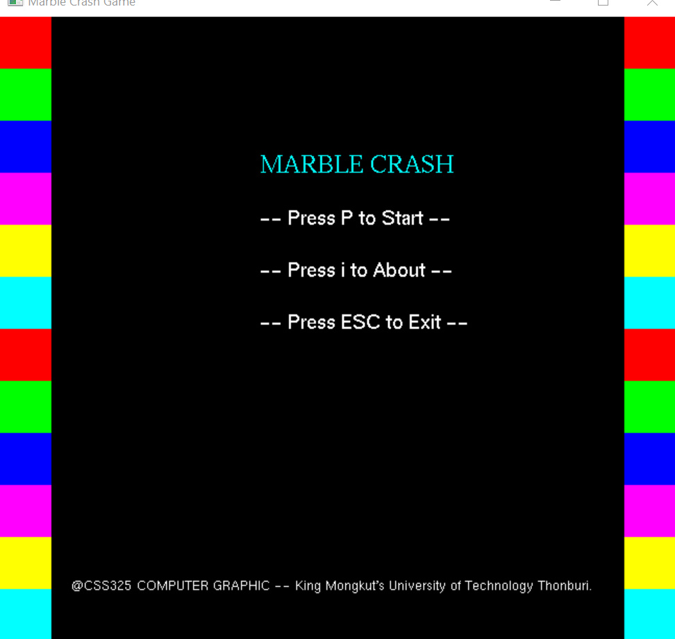
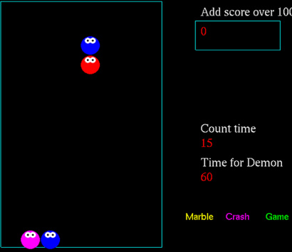
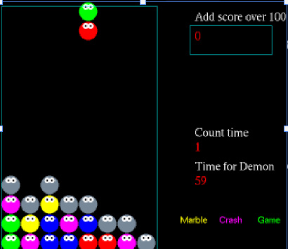
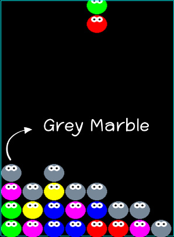
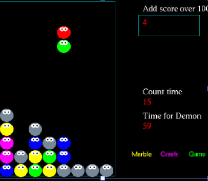
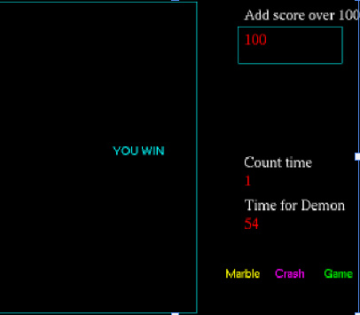
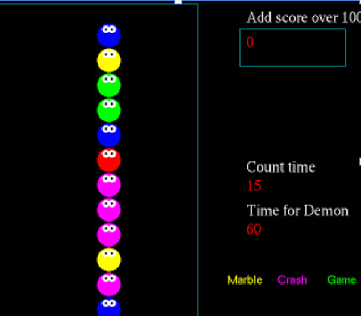

# c++ Marble Crash Game (Beta)

**c++ Marble Crash Game** (Marble Crash Game) is an puzzle game Which received the idea from Puyo Puyo Tertis game. I created a game with retro graphic style and simple operation as a part of a computer graphic at University. One of the main goals of this project is understanding to process of creating game. We use many OpenGl libraries in this project that you can see in the "Requirement". We recommend to use visual studio to run this project.
 

 
I developed this game by visual studio 2019(https://visualstudio.microsoft.com/) that is one of IDE(Integrated Development Environment). The source code is in this repository.

**Feature**
 
Object Transformation
 
Keyboard Event

**Requirement**
 
- Visual Studio(https://visualstudio.microsoft.com/)
 
- freeglut(OpenGL library)
 
- SOIL(OpenGL library)
 

**Setup**
 
- setup freeglut in Visual Studio(https://www.wikihow.com/Set-Up-an-OpenGL-FreeGLUT-GLEW-Template-Project-in-Visual-Studio)
 
- setup SOIL in Visual Studio(https://github.com/Friduric/simple-opengl-image-library)
 

**Process of game**

 
1) Marble dropped from upper to bottom .
 

 
2) When time count to Demon time, it adds  Gray Marble. 
 

 
 

 
** Gray Marble was created only this event.
 
 
3) If same color Marbles was next to each other, it will delete those Marbles.
(Gray Marble will be missing after Surrounded by color Marble)
 

 
- When point over 100, you win.
 

 
- When Marble pile up over line, you lose.
 

**Running**
It have .exe file in this repository is in the Debug folder.  You can run the executable .exe file, named game3.exe to play.
